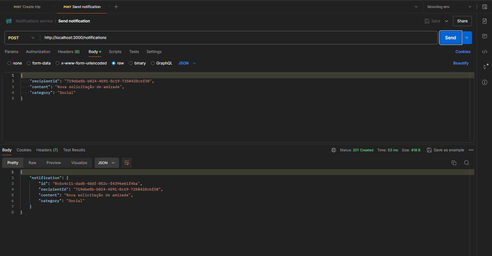

# Notifications Service (Node.js / Nest.js)

Um serviço de notificações aplicando a metodologia Domain Driven Design (DDD) com conceitos de arquitetura limpa, usando o framework Nest.js e testes unitários utilizando a biblioteca do Jest em todos os casos de uso.

## Requisitos

- Node.js;
- Pnpm
- Nest.js CLI;
- Conhecimentos básicos de DDD e Clean Architecture;

## Tecnologias

- Node.js;
- Nest.js;
- Prisma;
- SQLite;
- Class-validator;
- Jest;

## Steps

- Clone o repositório;
- Instale as dependências (`pnpm install`);
- Crie as tabelas no banco de dados (`pnpm prisma migrate dev`);
- Copie e cole `.env.example` file (`cp .env.example .env`);
- Rode a aplicação (`pnpm run start:dev`);
- Rode os testes (`pnpm run test:watch`);
- Teste as requisições na web ([Hoppscotch](https://hoppscotch.io/)).

 

---

Desenvolvido por <a href="https://www.linkedin.com/in/wellingtonrodriguesbr/" target="_blank">Wellington Rodrigues</a> ✌🏽

